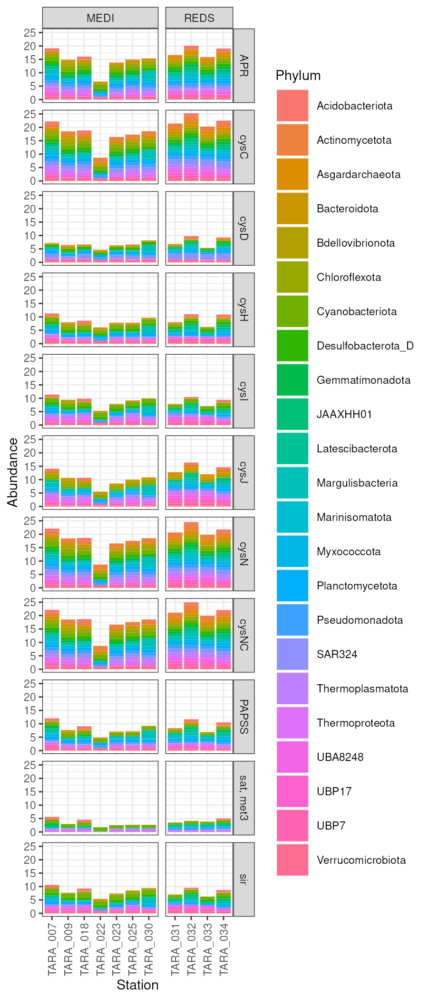
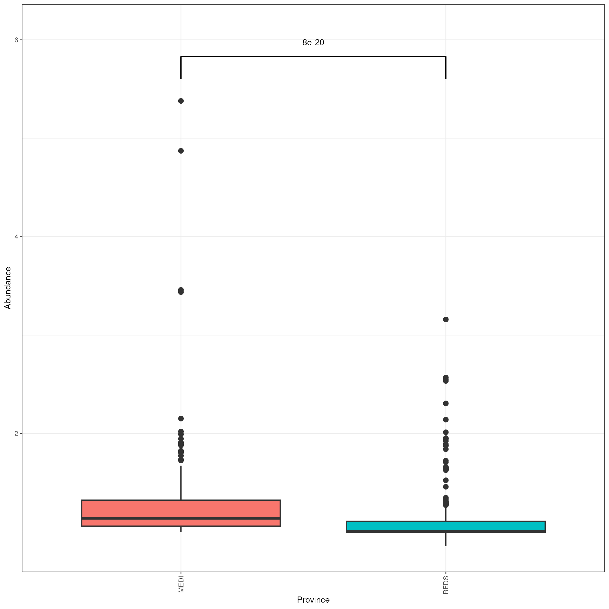
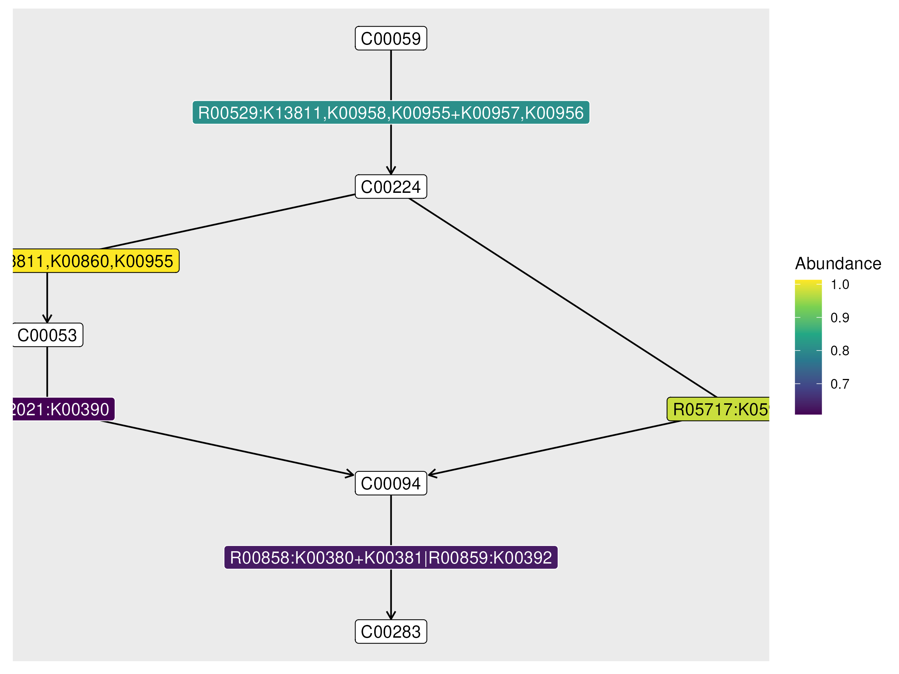

<!-- README.md is generated from README.Rmd. Please edit that file -->

# Thanos

<!-- badges: start -->
<!-- badges: end -->

Thanos is an R package for the functional profiling of metagenomic
samples. It can provide quantitative information about the abundance of
genes or pathways, using a normalization strategy that allows comparison
of depth scores across samples. The framework is the same whether you
want to analyze MAGs or contigs.

## Installation

You can install the development version of Thanos from
[GitHub](https://github.com/) with:

``` r
# install.packages("devtools")
devtools::install_github("zhezhaozoe/thanos")
```

## Usage

Thanos is based on [`phyloseq`](https://joey711.github.io/phyloseq/) and
it uses `phyloseq` objects to represent the abundances. We just need to
build an initial `phyloseq` object with the depths of our MAGs or
contigs, provide a path to the corresponding protein sequences files,
and build HMM profiles for the genes we are interested in. Thanos
compares the depth of the query genes with the depths of a universal
single-copy marker gene, so we need to provide HMM files for the control
gene as well. We recommend building the HMM from one of the 120
[GTDB](https://gtdb.ecogenomic.org/) markers. Basic familiarity with
`phyloseq` is a prerequisite for using Thanos.

### MAGs example

``` r
library(thanos)

# Import depths
mags_depths_files <- "inst/extdata/mags_example/depths/mag_depths_summary.tsv"
mags_otus <- import_mag_depths(mags_depths_files)

# Optionally, read sample metadata and taxonomy. This is used to build an
# initial phyloseq object. Sample and taxonomy metadata will be propagated
# to the final phyloseq object containing the depth scores for the genes
# of interest.
samplesheet <- read.table(
  "inst/extdata/samplesheets/samplesheet.tsv",
  header = TRUE,
  row.names = 1
)
gtdb_taxonomy <- read_gtdbtk("inst/extdata/mags_example/taxonomy/gtdbtk_summary.tsv")

# Build a phyloseq object from the OTUs with sample data and tax table
mags_ps <- phyloseq(
  mags_otus,
  sample_data(samplesheet),
  tax_table(gtdb_taxonomy)
)

# Path to the control gene profile
control_hmm <- "inst/extdata/controls/bac120_r214_reps_PF01025.20.hmm"

# Generate profiles for the query genes from a KEGG module
sulfur_assimilation <- "M00176"
interesting_KOs <- get_kegg_kos_from_module(sulfur_assimilation)
queries_hmm <- build_hmm_from_ko(interesting_KOs, nmax = 15)

# Provide a named vector with the paths to the protein sequences files
mags_sequences_files <- list.files("inst/extdata/mags_example/protein_sequences", full.names = TRUE)
names(mags_sequences_files) <- sub("\\.faa$", "", basename(mags_sequences_files))

# Get hits depths
mags_hits <- get_hits_depths_from_hmm(
  queries_hmm,
  control_hmm,
  mags_ps,
  mags_sequences_files,
  linker = mags_linker,
  taxrank = "Phylum"
)

barplot_depths(mags_hits, group = "Station", fill = "Phylum", wrap = c("Gene", "Province")) +
  guides(fill = guide_legend(ncol = 1)) +
  theme(
    legend.key.size = unit(0.4, "cm"),
    axis.text.x = element_text(angle = 90, hjust = 1, vjust = 0.5)
  )

boxplot_depths(mags_hits$cysNC, fill = "Province", signif = TRUE, show.legend = FALSE) +
  expand_limits(y = 6.1) +
  theme(
    axis.text.x = element_text(angle = 90, hjust = 1, vjust = 0.5)
  )

keggmodule_plot(sulfur_assimilation, setNames(mags_hits, interesting_KOs)) +
  theme_void(base_size = base_size) +
  theme(legend.position = "bottom")
```





### Contigs example
