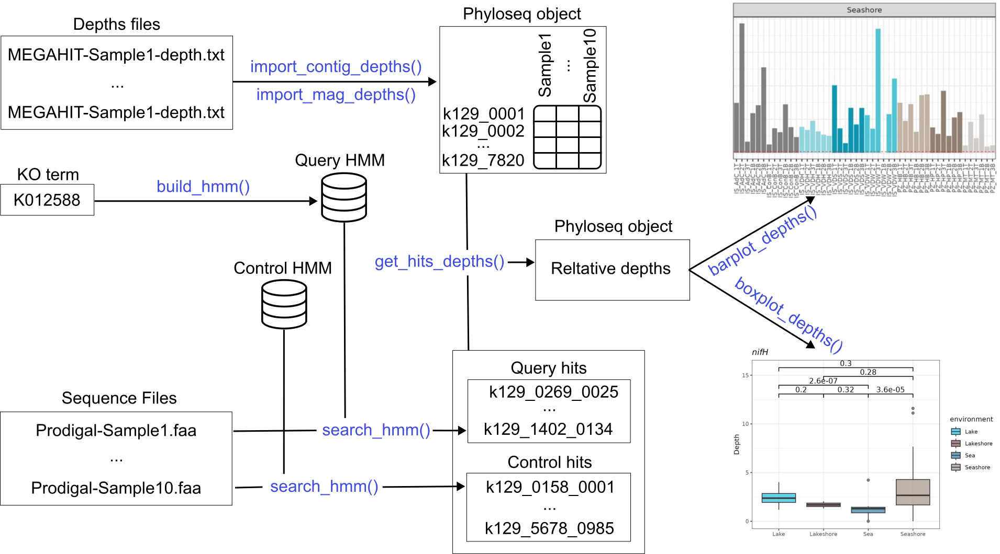

# Summary

Metagenomic research continues to advance, with an ever-expanding pool of sequencing data unveiling the complexity of microbial communities across diverse environments. There is a pressing need for tools that facilitate comprehensive analysis of these data and help to understand the functional potential encoded within metagenomic samples. `thanos` fills this gap by offering a user-friendly R package designed for analysis and visualization of gene composition in metagenomic samples. It allows researchers to go beyond the taxonomic profiles and find out which genes are prevalent across environments. The package can import data from multiple formats and offers high-level functions that allow researchers with diverse coding skill levels to perform the analysis.

# Statement of need

As the amount of metagenomic sequencing keeps increasing, there is a growing need for tools that help biologist make sense of the data. The `phyloseq` [@mcmurdie2013phyloseq] package is a powerful tool to explore microbiome profiles and it provides a convenient way to explore the taxonomic composition of metagenomic samples collected from different environments. However, the taxonomic profile offers only one view into the complex and multifaceded nature of biological samples. The gene composition of a sample offers a complementary view, one that can help answer questions such as: does carbon fixation occur in this environment?, or is methane metabolism more active in lakes or in the Atlantic ocean? This information is not always reflected in the taxonomic profiles. Besides, the gene functional profile can be obtained not just from the OTUs (Operatonal Taxonomic Units), but also directly from the contigs. This allows us to avoid the "binning bias" and consider all of the reads in a sample, not just those that were binned into MAGs (Metagenome-Assembled Genomes). As the functional profiling task is somewhat more complex than taxonomic profiling, there is currently no standard way to perform this analysis. Tools like Prokka [@seeman2014prokka] or the EggNog-mapper [@cantalapiedra2021eggnog] can indeed give a bulk-overview of the functional composition of a sample by annotating each gene with its hits, but researchers are often interested in more specific questions about individual genes, and require a more in-depth analysis. This package offers a gene-centric strategy, that allows researchers to delve into functional profiling of their genes of interest, by computing a "depth score" for each gene across samples. As `phyloseq` already provides convenient methods that are also applicable to functional profiles, `thanos` represents the functional depth of the genes of interest as a `phyloseq` object, inheriting useful methods such as taxa pruning, samples merging, taxa merging, as well as all the other `phyloseq` features. In addition, it provides specific functions to:

* import data from standard metagenomic tools;
* perform the functional annotation of the samples using HMMer;
* visualize the resulting profiles.

All by writing as little code as possible.

# Overview of the method

thanos requires three inputs: a list of genes of interest, which are identified by their KO (KEGG Ortholog) number [@kanehisa2000kegg]; the depths file, which represents the abundances of OTUs across samples (either raw contigs depths or binned MAGs depths); and the sequences files, which associate each OTU with the protein sequences that it contains. The `thanos` method consists in looking for the gene of interest in the sequences file using HMMer [@eddy2011hmm], then mapping the results back to the OTUs, in order to get a depth profile of the gene of interest across samples. However, these raw depths are not comparable across samples due to different overall sequencing depths. For this reason, they are normalised by the depths of the hits of single-copy marker genes that are universally conserved (for instance, any of the 120 marker genes from GTDB [@parks2021gtdb]). This enables us to interpret the final score as the average copy number of the gene of interest in the sample. An overview of the functions available in the package is shown in \autoref{fig:workflow}. However, there are also high-level function that automate most of the analysis in one step, as well as functions optimised for large-scale data. The reader is invited to consult the vignette of the package for further details.

# Acknowledgments:
This work was supported by the China Scholarship Council and the Science & Technology Basic Resources Investigation Program of China (Grant No. 2017FY100300).
